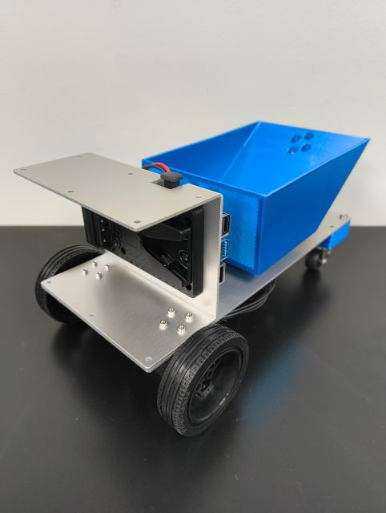

# MiRoREA Dump Truck

MiRoREA Dump Truckは，シリアルサーボモータを用いたベッセル付きの対向二輪のダンプトラック型の模型建設ロボットです．

{ style="display:block; margin:0 auto; width:300px;" }

!!! warning
    使用しているモータが入手しにくくなっているため，別のモータへの変更を検討しています．  
    しばらくお待ちください．  

## Capabilities

- 車輪による移動
- ベッセルの上げ下げによる運搬・荷下ろし

## Features

- 左右車輪・ベッセルの各関節のモータの制御
- 左右車輪・ベッセルの各関節の回転数・角度の計測
- 搭載LEDの点灯・消灯
- IMUによる姿勢等の推定 等

## License and Terms of Use

Under preparation