<!-- # Step 1 3Dプリント部品の造形 -->

センサやボードPCの取り付けに3Dプリントした部品を使います．  
下記に従い3Dプリントしてください．  

!!! warning
    公開するにあたり，CADソフトのライセンスの関係で，全ての部品のデータを作り直しています．  
    オリジナルの部品と同じ寸法で設計していますが，CADソフトの機能の関係で設計を変更している箇所があります．  
    主要な箇所の形状が一致することを確認していますが，2026年3月現在，実際に3Dプリントして組み立てられるかの検証はできていません．  

!!! warning
    使用していたモバイルバッテリー（Anker PowerCore 10000）がリコールになり，入手できなくなりました．  
    2026年3月現在，代替品を検討中で，バッテリマウントのCADデータはAnker PowerCore 10000用しかありません．  

## STLファイルとCADデータ

3Dプリントに必要なSTLファイルは，下記にアップロードしています．  
ダウンロードして利用してください．  
また，もとになっているFreeCADのCADデータ，および中間ファイルのSTEPファイルもアップロードしています．  

<https://github.com/Open-MiRoREA/mirorea_excavator_cad>

## 基本的な3Dプリンタの設定

組み立てに必要な形状を再現でき，十分な強度があれば，基本的にはどのような設定でも構いません．  
これまで製作した際には，概ね下記のような設定で3Dプリントしました．

- **3Dプリント方式**  
    FDM方式
- **フィラメント**  
    PLA
- **ノズル**  
    0.4 mm
- **積層ピッチ**  
    0.2～0.3 mm
- **上下面の厚さ**  
    3～5層程度になる厚さ
- **壁の厚さ**  
    3～5層程度になる厚さ
- **インフィル密度**  
    50 %程度だったと思います．  
    比較的どのパーツも小さく薄いので，インフィルをどう設定してもほぼ100 %と同様になると思います．  
    バッテリマウントについては，多少下げても良いと思います．  
    また，面の広いパーツについては，インフィルを適当に下げて，上下の仕上げ面をなし（0層）にすることで，インフィルを露出させて，メッシュにすることもありました．  

必要に応じて変更して構いません．  
その他の設定については，各自の環境に合わせて設定してください．  
積層方向とサポート材の有無，必要個数については，下記の各パーツごとの説明を参照してください．    
 

## ブーム用ポテンショメータマウント

ブームの関節角度を測るポテンショメータを固定するためのマウントです．  

- **STLファイル**  
    boom_potentiometer_mount.stl
- **必要個数**  
    1
- **サポート材**  
    不要
- **積層方向**  
    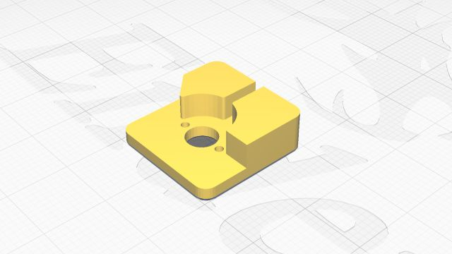{ style="display:block; margin:0 auto; max-height:300px;" }

## ブーム用ポテンショメータシャフト

ブームの関節角度を測るポテンショメータを回転させるための軸です．  

- **STLファイル**  
    boom_potentiometer_shaft.stl
- **必要個数**  
    1
- **サポート材**  
    必要
- **積層方向**  
    根元の片側が斜めにカットされているため，図のように，その面が上になるように設定してください．  

    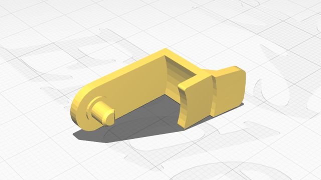{ style="display:block; margin:0 auto; max-height:300px;" }

## アーム用ポテンショメータマウント

アームの関節角度を測るポテンショメータを固定するためのマウントです．  

- **STLファイル**  
    arm_potentiometer_mount.stl
- **必要個数**  
    1
- **サポート材**  
    不要
- **積層方向**  
    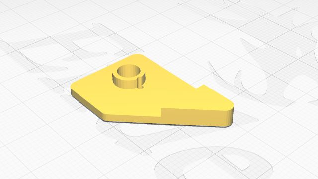{ style="display:block; margin:0 auto; max-height:300px;" }

## アーム用ポテンショメータシャフト

アームの関節角度を測るポテンショメータを回転させるための軸です．  

- **STLファイル**  
    arm_potentiometer_shaft.stl
- **必要個数**  
    1
- **サポート材**  
    必要
- **積層方向**  
    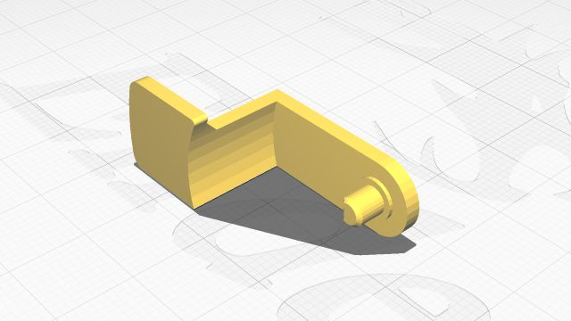{ style="display:block; margin:0 auto; max-height:300px;" }

## バケット用ポテンショメータマウント

バケットの関節角度を測るポテンショメータを固定するためのマウントです．  

- **STLファイル**  
    bucket_potentiometer_mount.stl
- **必要個数**  
    1
- **サポート材**  
    必要
- **積層方向**  
    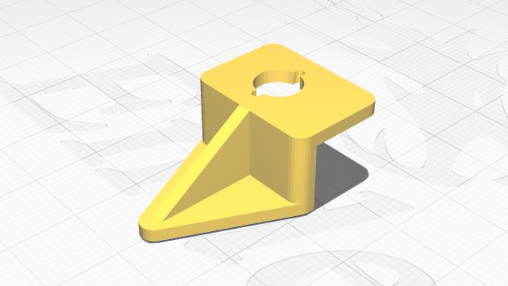{ style="display:block; margin:0 auto; max-height:300px;" }

## バケット用ポテンショメータシャフト

バケットの関節角度を測るポテンショメータを回転させるための軸です．  

- **STLファイル**  
    bucket_potentiometer_shaft.stl
- **必要個数**  
    1
- **サポート材**  
    必要
- **積層方向**  
    外側のカットされた面が下になるように設定してください．  

    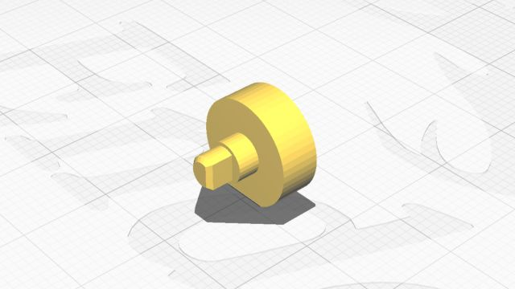{ style="display:block; margin:0 auto; max-height:300px;" }

    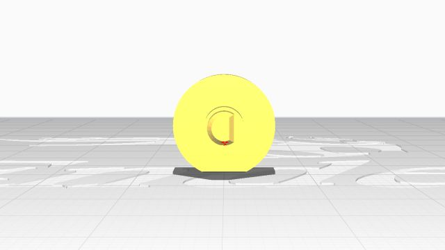{ style="display:block; margin:0 auto; max-height:300px;" }
    
    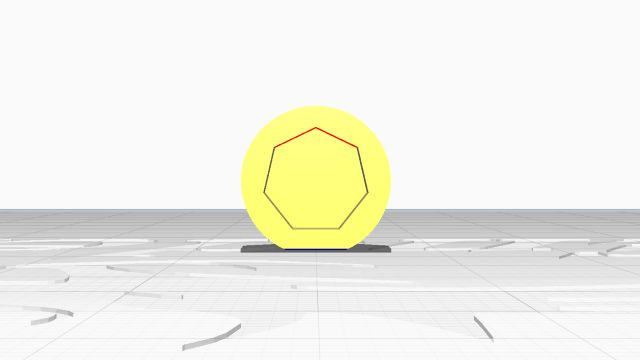{ style="display:block; margin:0 auto; max-height:300px;" }

## 旋回軸用フォトリフレクタホルダ

下部走行体と上部旋回体の間の旋回角の推定に用いるフォトリフレクタのホルダ（カバー）です．  

- **STLファイル**  
    swing_photointerrupter_holder.stl
- **必要個数**  
    1
- **サポート材**  
    不要
- **積層方向**  
    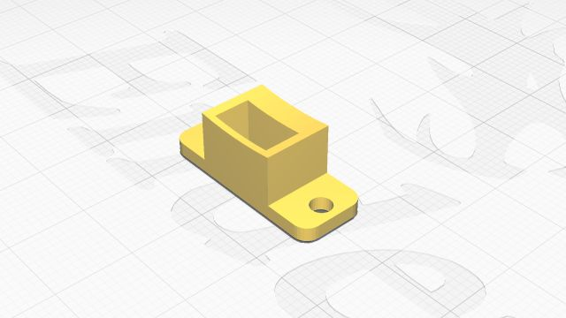{ style="display:block; margin:0 auto; max-height:300px;" }

## 旋回軸用グラデーションリング

下部走行体と上部旋回体の間の旋回角の推定に用いるグラデーションのついたテープを貼り付けるリング状の台座です．  

- **STLファイル**  
    swing_gradation_ring.stl
- **必要個数**  
    2
- **サポート材**  
    不要
- **積層方向**  
    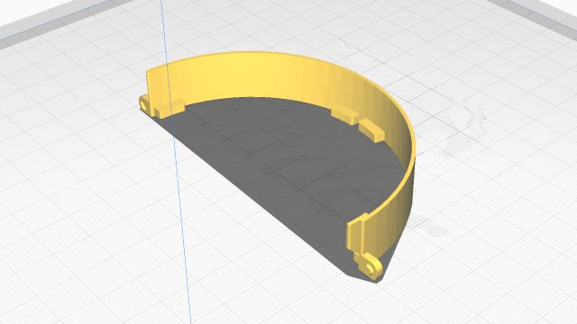{ style="display:block; margin:0 auto; max-height:300px;" }

## バッテリホルダベース

キャビンがあった場所にモバイルバッテリ用のホルダを取り付けるための台座です．  

- **STLファイル**  
    battery_holder_base.stl
- **必要個数**  
    1
- **サポート材**  
    必要
- **積層方向**  
    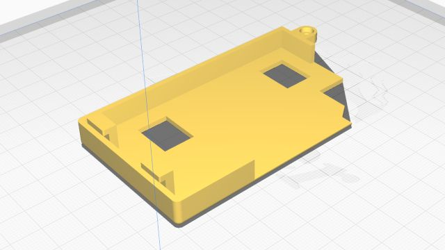{ style="display:block; margin:0 auto; max-height:300px;" }

## バッテリホルダ

制御用電源として用いるモバイルバッテリを載せるホルダです．  

- **STLファイル**  
    battery_holder_anker_powercore_10000.stl
- **必要個数**  
    1
- **サポート材**  
    不要
- **積層方向**  
    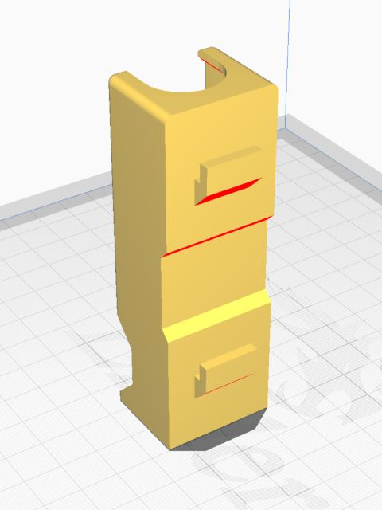{ style="display:block; margin:0 auto; max-height:300px;" }

## Rasppbery Piマウント

Rasppbery Piを取り付けるための台座兼駆動用バッテリ搭載スペースのカバーです．  

- **STLファイル**  
    raspberrypi_mount.stl
- **必要個数**  
    1
- **サポート材**  
    必要
- **積層方向**  
    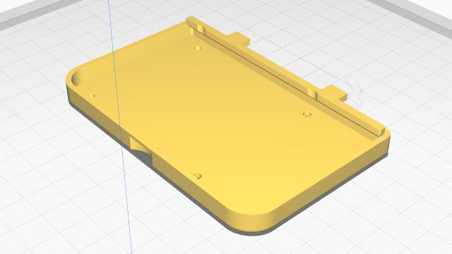{ style="display:block; margin:0 auto; max-height:300px;" }