# Step 3 ベースラジコンの分解

MiRoREA Excavatorは市販のショベル型のラジコンをベースにしています．  
不要な部品を取り外し，ロボットとして必要な部品を取り付けるために，まずベースラジコンの分解を行います．  

## クローラベルトの取り外し

部品の取り付けの邪魔になるため，一度左右のクローラベルトを取り外します．  
クローラベルトを少し引っ張りながら，スプロケットから外すように外側にずらすと，クローラベルトを取り外すことができます．

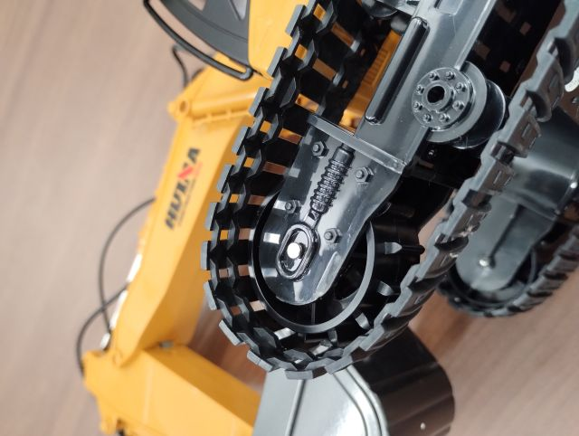{ style="display:block; margin:0 auto; max-height:300px;" }

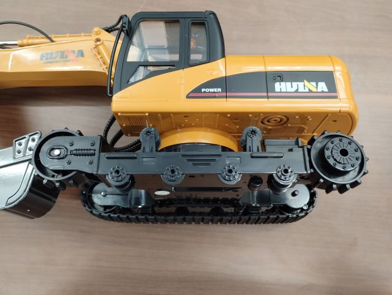{ style="display:block; margin:0 auto; max-height:300px;" } 

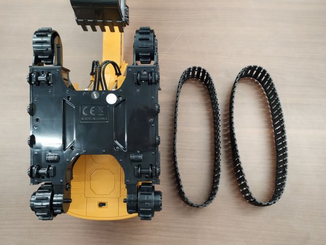{ style="display:block; margin:0 auto; max-height:300px;" }

## 後部カバーの取り外し

内部の不要部品を取り外し，別の部品を取り付けるために，一度上部旋回体の後部のカバーを取り外します．  
下部走行体を手で回転させながら（バキバキ音が鳴りますが大丈夫です），上部旋回体の底面のねじをすべて外し，上面のキャビン反対側に取り付けられている飾りの手すりを外すと，後部カバーを取り外すことができます．  
（ねじは再度カバーを取り付ける際に使用します．）  
後部カバーから電源ケーブルが伸びていると思いますが，これは使用しないので，基板からコネクタを外し，後部カバーからも外して構いません．    

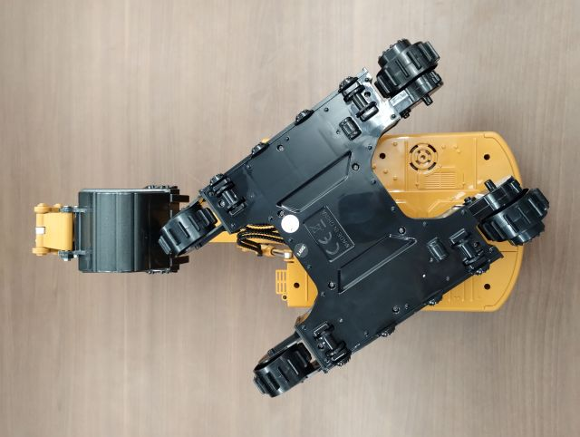{ style="display:block; margin:0 auto; max-height:300px;" }

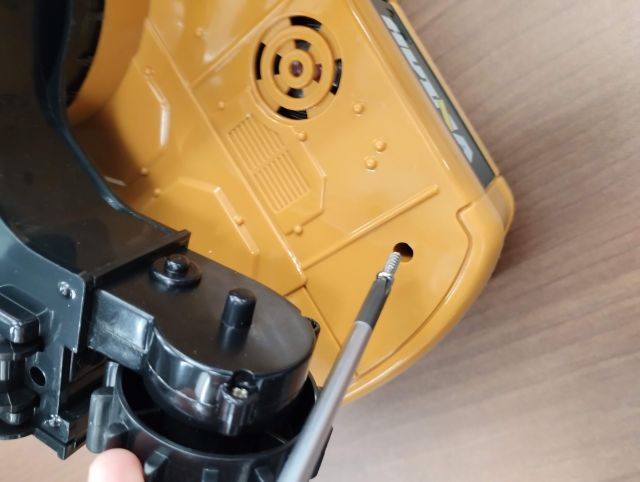{ style="display:block; margin:0 auto; max-height:300px;" } 

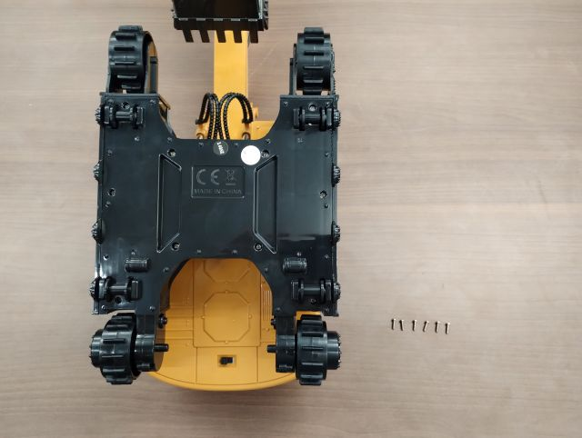{ style="display:block; margin:0 auto; max-height:300px;" }

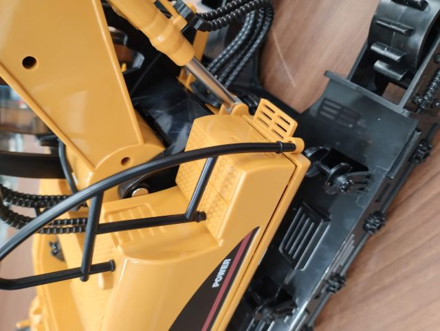{ style="display:block; margin:0 auto; max-height:300px;" }

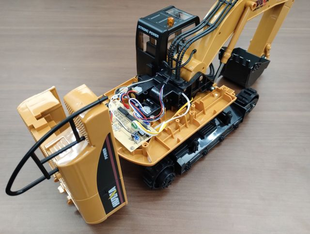{ style="display:block; margin:0 auto; max-height:300px;" } 

## 不要部品の取り外し

ラジコン回路，スピーカは使用しないので，各ケーブルのコネクタを外した後で，それぞれの固定ねじを外し，取り外してください．  
また，キャビンも使用しないため，取り外してください．  
後部のねじを外し，前方の爪が外れるように引き抜くと取り外すことができます．  
（2本のねじの内，1本は3Dプリント部品の取り付けに使用します．）

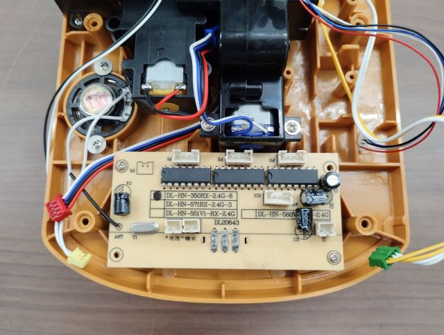{ style="display:block; margin:0 auto; max-height:300px;" }

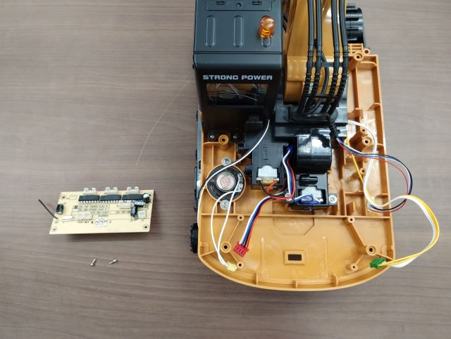{ style="display:block; margin:0 auto; max-height:300px;" } 

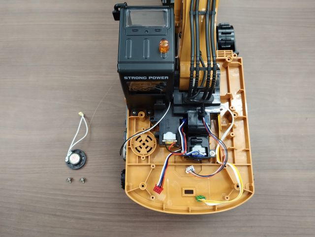{ style="display:block; margin:0 auto; max-height:300px;" }

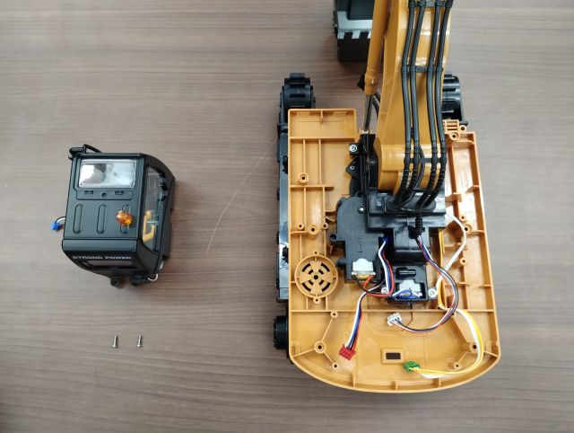{ style="display:block; margin:0 auto; max-height:300px;" }