# ポテンショメータの取り付け

ブーム・アーム・バケットの各関節にポテンショメータ（と3Dプリントのマウントや軸）を貼り付けます．  
下記に従い，位置を合わせ，接着剤で貼り付けてください．  

!!! warning
    使用中に外れないようにしっかり固定してください．  
    一方で，接着剤が余計なところに着かないように注意してください．  
    特に関節の可動部に入ると，張り付いて動かなくなったり，ポテンショメータ内部に入ると，角度を計測できなくなる危険性があります．  
    接着剤をつける前に一度取り付け位置に当てて確認することと，接着剤は少なめにつけて後から足すことをお勧めします．

!!! note
    3Dプリントの精度によっては，上手く取り付けられない場合があります．  
    その場合は，3Dプリンタの設定を調整して再度製作するか，ニッパーやカッターなどでサイズを調整してください．  

## ブーム

ポテンショメータは，ブーム軸の左側（キャビンがあった側）のギヤボックスのケースに貼り付けます．  
下図の赤の破線のように，部品の辺や溝を合わせると，概ねブームの回転軸とポテンショメータの回転軸が合います．  
接着剤は斜線の部分につけてください．  

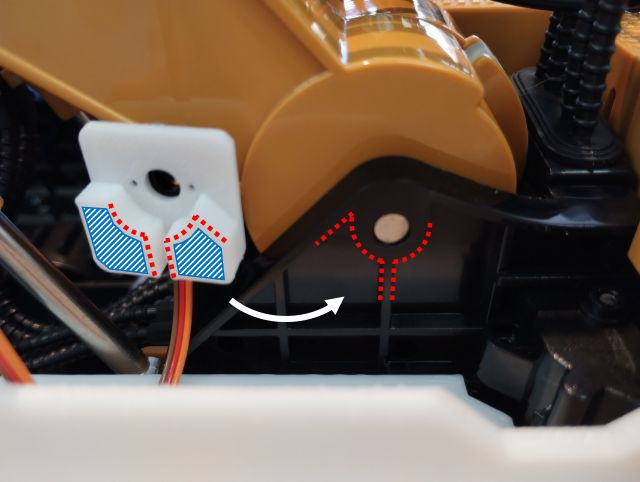{ style="display:block; margin:0 auto; max-height:300px;" }

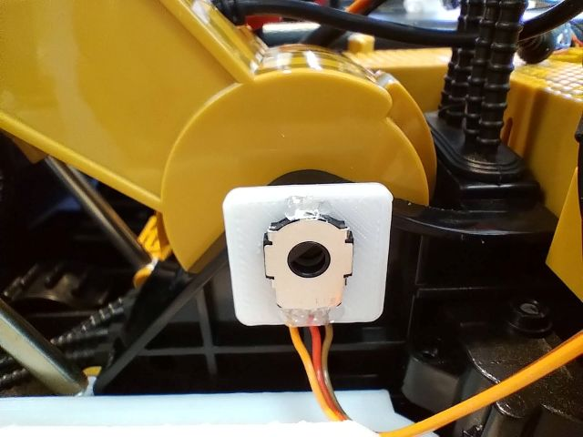{ style="display:block; margin:0 auto; max-height:300px;" } 

ポテンショメータを回転させる軸は，ポテンショメータの穴に指した上で，ブーム本体のフレームに貼り付けます．  
下図のように，破線の位置を合わせて取り付けてください．  
特に，ポテンショメータの穴と3Dプリントの軸はDカットになっているので，無理に取り付けず，回転させて位置を合わせてください．  
接着剤は斜線の部分につけてください．  

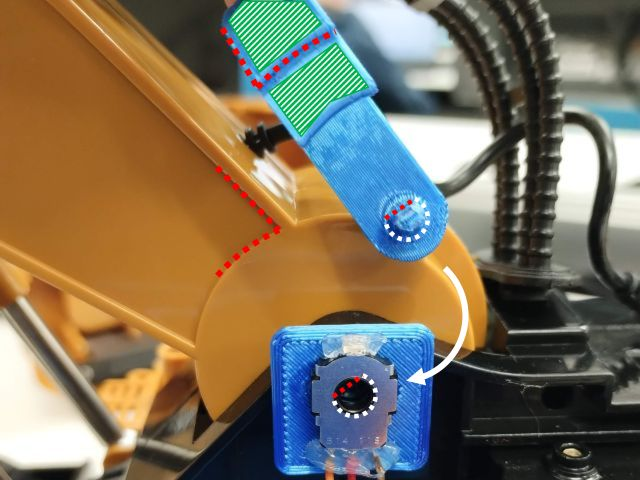{ style="display:block; margin:0 auto; max-height:300px;" }

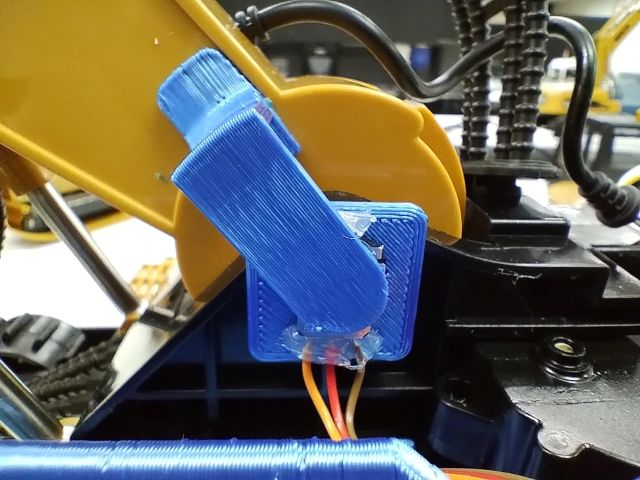{ style="display:block; margin:0 auto; max-height:300px;" } 

## アーム

ポテンショメータは，アーム軸左側のブームのフレームに貼り付けます．  
下図のように，破線の位置を合わせて取り付けてください．  
3Dプリントのマウントの円形の突起は，軸上の穴に指さります．  

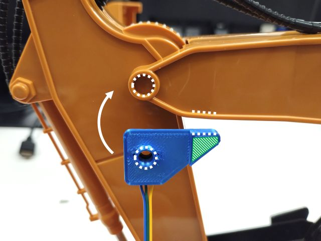{ style="display:block; margin:0 auto; max-height:300px;" }

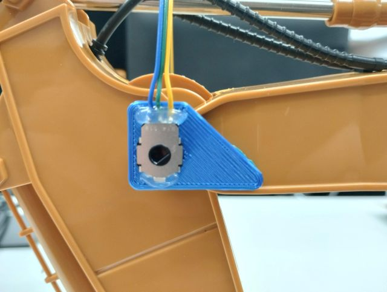{ style="display:block; margin:0 auto; max-height:300px;" } 

ポテンショメータを回転させる軸は，ポテンショメータの穴に指した上で，アームのフレームに貼り付けます．  
下図のように，破線の位置を合わせて取り付けてください．  
特に，ポテンショメータの穴と3Dプリントの軸はDカットになっているので，無理に取り付けず，回転させて位置を合わせてください．  
接着剤は斜線の部分につけてください．  

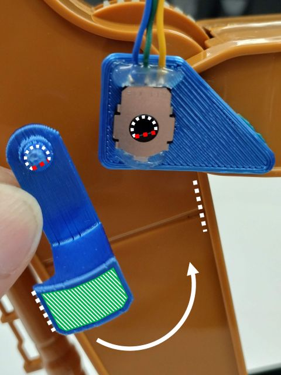{ style="display:block; margin:0 auto; max-height:300px;" }

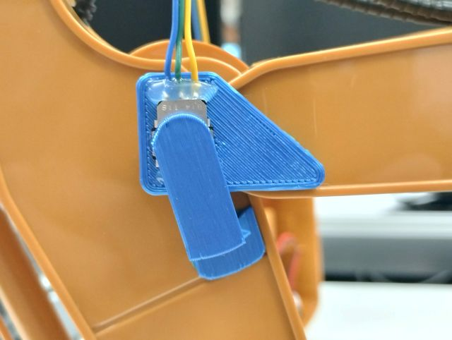{ style="display:block; margin:0 auto; max-height:300px;" } 

## バケット

ブームは，構造が異なるため，軸側から取り付けます．  
3Dプリントの軸をバケットを動作させているリンクに取り付けます．  
下図のように，破線の位置を合わせて取り付けてください．  
正七角形になっているため，どの向きでも取り付けられますが，3Dプリント時の底面が赤線の位置になる（バケットを動作させるリンク側に来る）ようにしてください．  
なお，接着剤はなしで大丈夫です．  

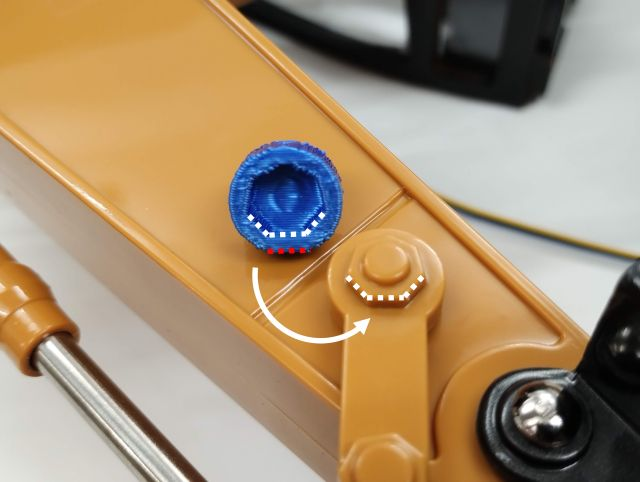{ style="display:block; margin:0 auto; max-height:300px;" }

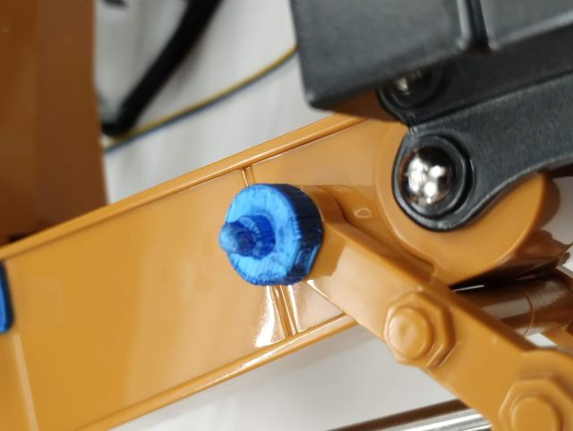{ style="display:block; margin:0 auto; max-height:300px;" } 

ポテンショメータは，バケットのリンク軸左側のアームのフレームに貼り付けます．  
下図のように，破線の位置を合わせて取り付けてください．  
特に，ポテンショメータの穴と3Dプリントの軸はDカットになっているので，無理に取り付けず，回転させて位置を合わせてください．    
接着剤は斜線の部分につけてください．  

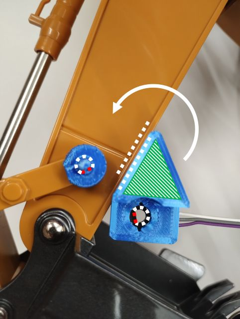{ style="display:block; margin:0 auto; max-height:300px;" }

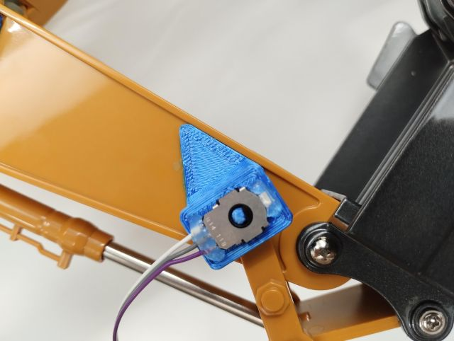{ style="display:block; margin:0 auto; max-height:300px;" } 