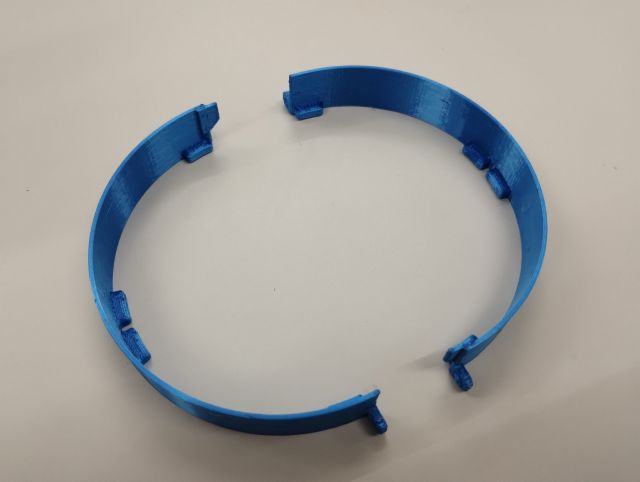
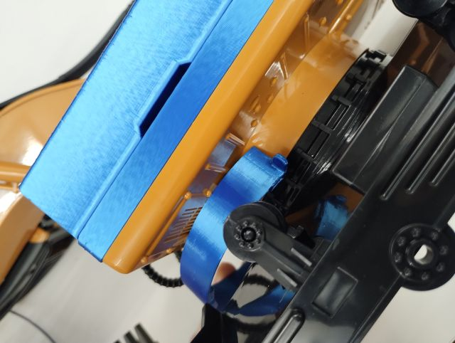
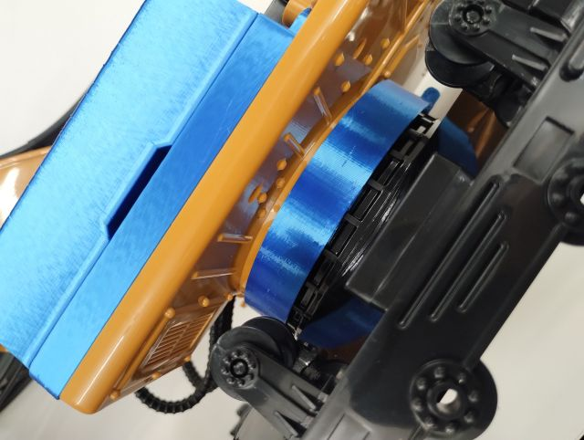
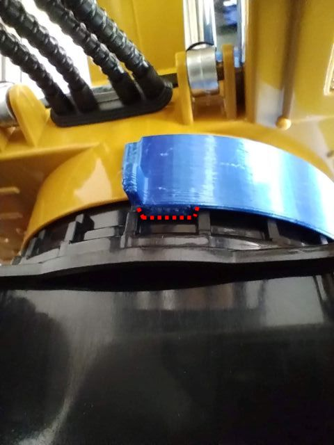
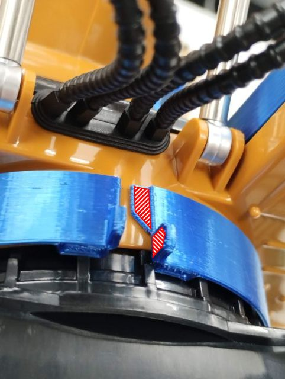
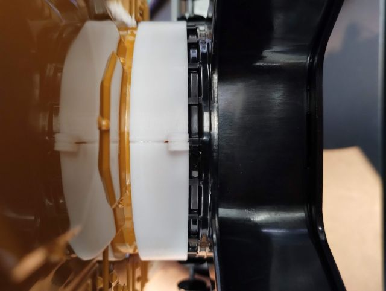
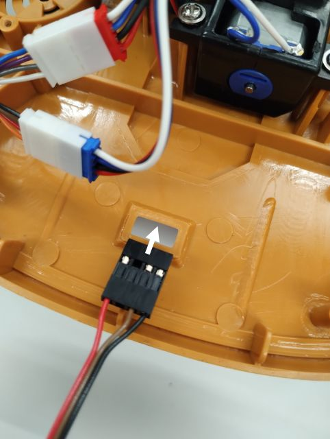
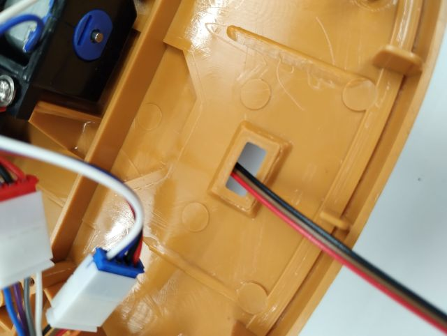

# Step 5 旋回角推定センサの取り付け

## リングの取り付け

旋回角推定用のグラデーション付きテープを貼り付ける土台となるリングを取り付けます．  
リングは，左右に分割された点対称の構造を持つ3Dプリント部品です．  

{ style="display:block; margin:0 auto; max-height:300px;" }

これを下部走行体と上部旋回体の間に取り付けます．  
すき間から差し込み，下図のように，リングの内側の凸部と下部走行体の旋回部分の台座の凹部がかみ合い，かつ，リングの耳が中央に来るようにしてください．  

{ style="display:block; margin:0 auto; max-height:300px;" }

{ style="display:block; margin:0 auto; max-height:300px;" }

{ style="display:block; margin:0 auto; max-height:300px;" }

両側同様に取り付けたら，下図の斜線の部分に接着剤をつけて左右のリングを接着してください．  
前後共に同様に接着してください．  

{ style="display:block; margin:0 auto; max-height:300px;" }

{ style="display:block; margin:0 auto; max-height:300px;" }

## ケーブルの配線

フォトリフレクタとADコンバータを接続するケーブルを配線します．  
上部旋回体の後方に，元々ラジコンの電源スイッチがついていた穴があるので，そこから裏側に通します．  

!!! note
    穴の幅とコネクタの幅がほぼぴったりでした．  
    押し込めば通りましたが，製品のばらつきにより通らないことがあるかもしれません．  
    その場合は，一度コネクタのハウジングを外しケーブルを通してからつけ直すか，穴を広げるかする必要があります．  

{ style="display:block; margin:0 auto; max-height:300px;" }

{ style="display:block; margin:0 auto; max-height:300px;" }

## グラデーション付きテープ・フォトリフレクタの取り付け

（Under preparation）