<!-- # 基板のはんだ付けとケーブルの作製 -->

制御基板とセンサ基板に部品をはんだ付けします．  
また，併せて必要な電源，モータ，センサ用のケーブルも作ります．  

## 制御基板のはんだ付け

基板上のシルク，写真，回路図（基板データのリポジトリを参照）を参考に各部品をはんだ付けします．  
コネクタ，ICソケット，LEDは向きに注意してください．  

!!! note
    写真では，抵抗が内蔵されたLEDを使っています．  
    このため，R3には抵抗をつけずに，余ったLEDの足でジャンプさせています．  
    抵抗が必要な場合には，R3にはんだ付けしてください．  

!!! note
    IMU（Z1），バッテリ電圧測定用の分圧抵抗（R1，R2），拡張用コネクタ（J5，J6）はオプションです．  
    不要であればはんだ付けしなくても構いません．  
    また，拡張用コネクタ（J5，J6）は必要に応じて他のコネクタに変更しても構いません．      

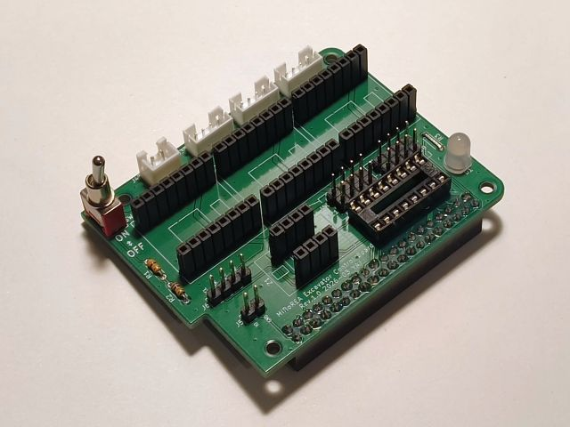{ style="display:block; margin:0 auto; max-width:600px;" }

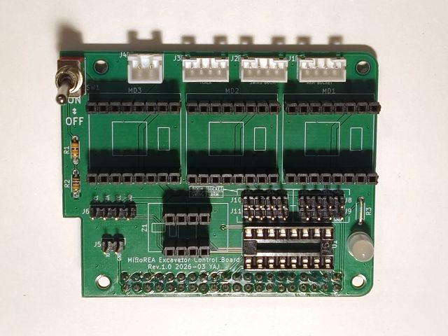{ style="display:block; margin:0 auto; max-width:600px;" }

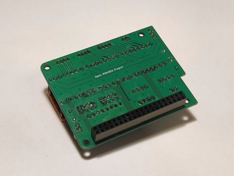{ style="display:block; margin:0 auto; max-width:400px;" }

基板上のシルクや写真を参考に，ADコンバータ，モータドライバ，IMUを基板上のソケットに取り付けます．  
いずれも向きに注意してください．  
また，モータドライバやIMUにピンヘッダが付けられていない場合には，先にはんだ付けしてください．  

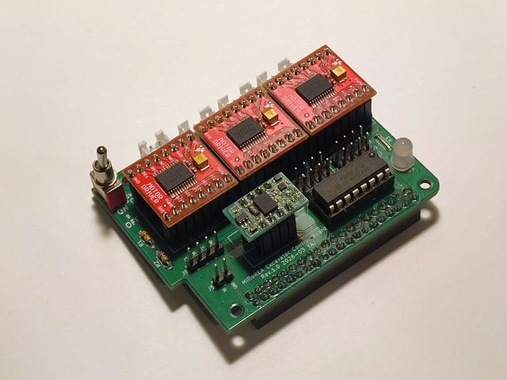{ style="display:block; margin:0 auto; max-width:600px;" }

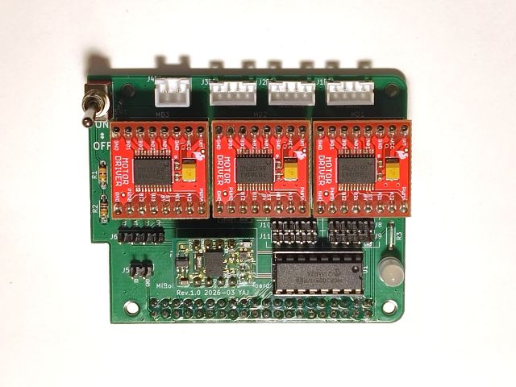{ style="display:block; margin:0 auto; max-width:600px;" }

## 旋回角推定用のセンサ基板のはんだ付け

基板上のシルク，写真，回路図を参考に各部品をはんだ付けします．  
フォトリフレクタ（U1）は向きに注意してください．  

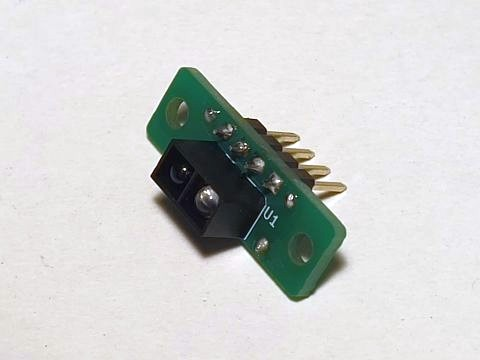{ style="display:block; margin:0 auto; max-width:400px;" }

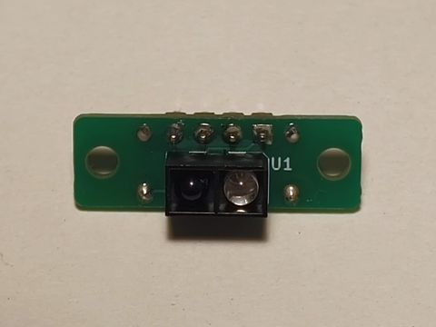{ style="display:block; margin:0 auto; max-width:400px;" }

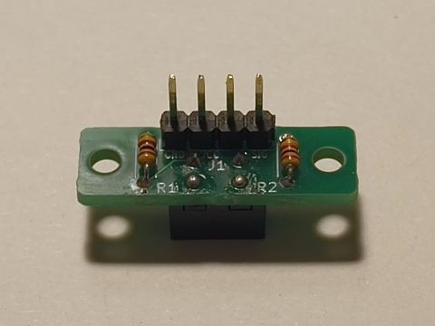{ style="display:block; margin:0 auto; max-width:400px;" }

## 電源ケーブルの延長

駆動用バッテリを繋ぐ電源ケーブルも元の状態だと短いため，カバーの外に出るように延長します． 

!!! note
    モータのケーブルと同様に，元々ついているコネクタを切断し，追加のケーブルをはんだ付けして延長する方法を説明しますが，他の方法でも構いません．  
    ここでは，元々ついているケーブルを切断し，追加のケーブルをはんだ付けして延長する方法を説明します．  
    ただし，必要な長さになって，両端に正しいコネクタがついていれば，新たにケーブルを作り直す等，他の方法でも構いません．  

まず，カバーの裏に伸びている電源ケーブルを先端で切断し，コネクタを取り外します．  

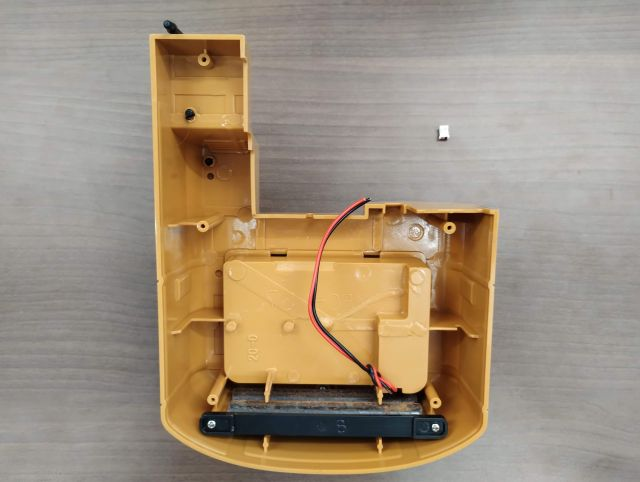{ style="display:block; margin:0 auto; max-width:400px;" }

次に，長さ100 mmのダブルコードを作製し，片側に2ピンのXHコネクタをつけ，反対側の被膜を剥いでおきます．

!!! warning
    コネクタの向きに注意してください．  
    逆にすると壊れる可能性があります．  
    XHコネクタの1番が黒（マイナス側），2番が赤（プラス側）です．  
    コネクタのハウジング上に刻印された番号や1番側の三角形のマークを参考にしてください．  

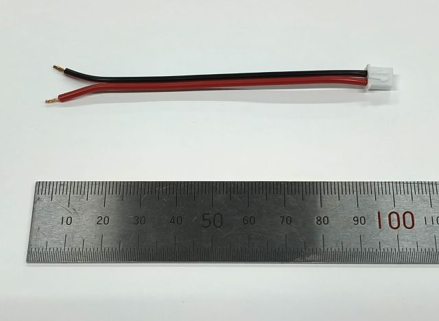{ style="display:block; margin:0 auto; max-width:400px;" }

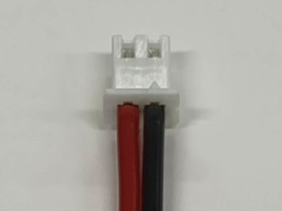{ style="display:block; margin:0 auto; max-width:400px;" }

最後に，カバーについている電源ケーブルと作製したケーブルの芯線をはんだ付けしてつなぎます．  
赤と赤，黒と黒の線同士が繋がって,延長された状態になっていることを確認してください．  
また，隣の線の間で導通しないように，熱収縮チューブを各線のはんだ付けした箇所に被せてください．  

{ style="display:block; margin:0 auto; max-width:400px;" }

## クローラ用，旋回・ブーム用モータケーブルの延長

クローラを回転させるモータのケーブルと旋回軸とブームを回転させるモータのケーブルが元の状態だと短いため，カバーの外に出るように延長します．  

!!! note
    ここでは，元々ついているケーブルを切断し，追加のケーブルを間にはんだ付けして延長する方法を説明します．  
    ただし，必要な長さになって，端に元と同じ規格のコネクタがついていれば他の方法でも構いません．  
    他の方法としては，  

    - ケーブルをすべて作り直し，モータにはんだ付けする．  
    - コネクタを両端に付けた延長分の長さのケーブルを作り，中継コネクタで接続する．  
    
    などがあります．  

まず，元々ついているクローラ用モータケーブルと旋回・ブーム用モータケーブルをぞれぞれ切断します．  

{ style="display:block; margin:0 auto; max-width:400px;" }

長さ150 mmの4芯のリボンケーブルを作製し，被膜を剥いで切断したケーブルの芯線とはんだ付けしてつなぎます．  
必ず元のケーブルの同じ色の線同士が繋がって，延長された状態になっていることを確認してください．  
また，隣の線の間で導通しないように，熱収縮チューブを各線のはんだ付けした箇所に被せてください．  
必要に応じて，はんだ付けした箇所がばらけないように，さらに外側から大きい熱収縮チューブでまとめても構いません．  

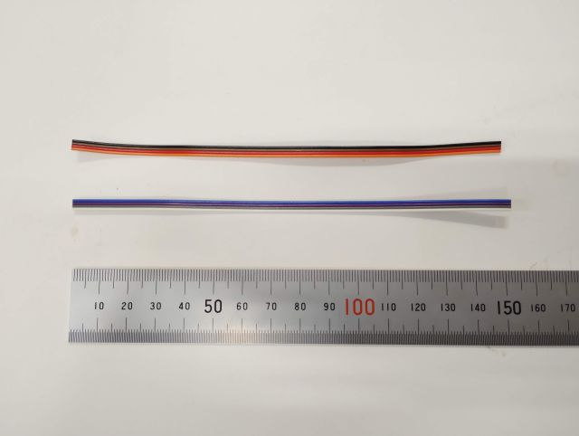{ style="display:block; margin:0 auto; max-width:400px;" }

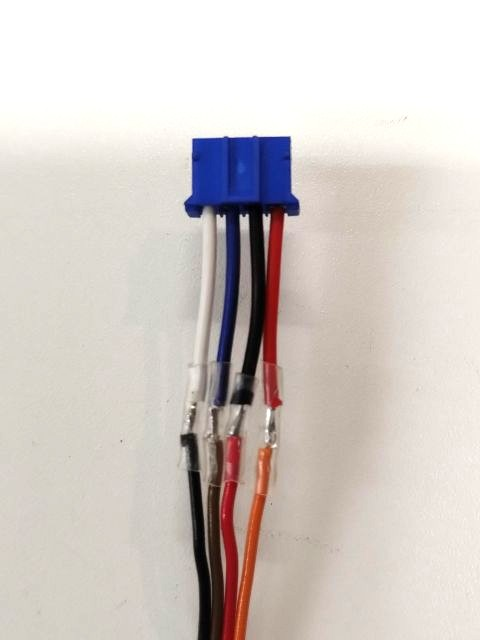{ style="display:block; margin:0 auto; max-width:400px;" }

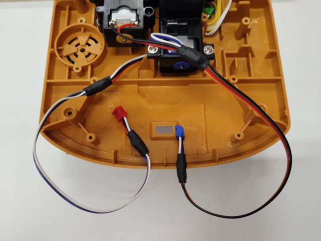{ style="display:block; margin:0 auto; max-width:400px;" }

## センサケーブルの作製

上部旋回体と下部走行体の間の旋回角度を推定するためのフォトリフレクタ，ブーム・アーム・バケットの回転角度を計測するためのポテンショメータを制御基板に接続するためのケーブルを作製します．  

!!! warning
    写真に従って，どのピンが接続されているかをよく確認して作ってください．  
    接続を間違うと計測できません．  
    コネクタは，1番に三角形のマークがついているはずなので，参考にしてください．  

!!! note
    必要な長さがあり，同じピン同士が接続されていれば，ケーブルの色は何色でも構いません．  
    なお，長さ60 cmの9芯（以上）のリボンケーブルから，必要な分を裂いたり切ったりすることで，全て作ることができます．  

### 旋回

両端にQIコネクタを取り付けた長さ40cmの3芯のリボンケーブルを1本作ります．  

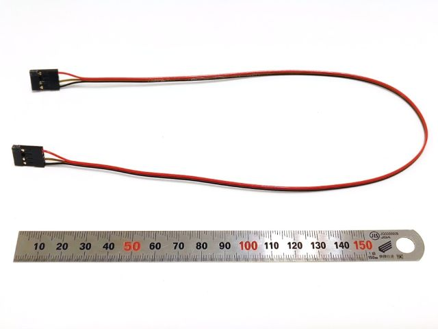{ style="display:block; margin:0 auto; max-width:400px;" }

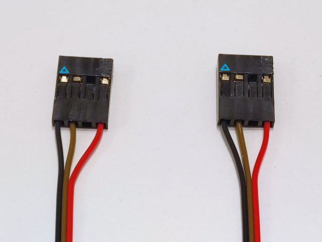{ style="display:block; margin:0 auto; max-width:400px;" }

### ブーム・アーム・バケット

片側にポテンショメータをはんだ付けし，反対側にQIコネクタを取り付けた3芯のリボンケーブルを3本作ります．   
リボンケーブルの長さは，それぞれブーム用が20 cm，アーム用が45 cm，バケット用が60 cmです．  
ポテンショメータが本来は表面実装用のためピンが小さいですが，上手くピンの上面にはんだを盛って取り付けてください．  
また，QIコネクタ側のケーブルがクロスしていることに注意してください．  

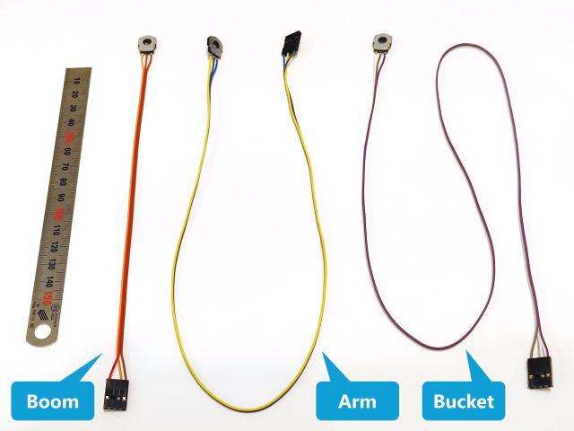{ style="display:block; margin:0 auto; max-width:400px;" }

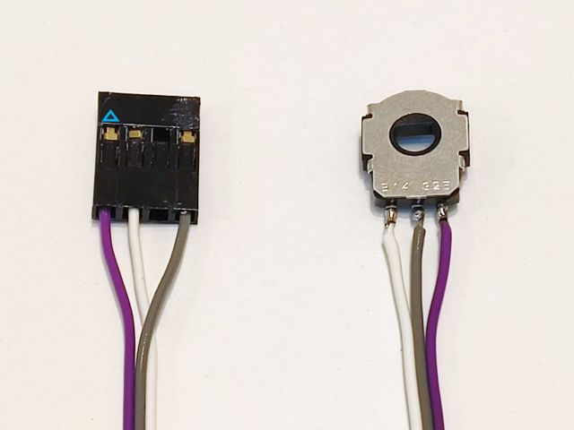{ style="display:block; margin:0 auto; max-width:400px;" }
