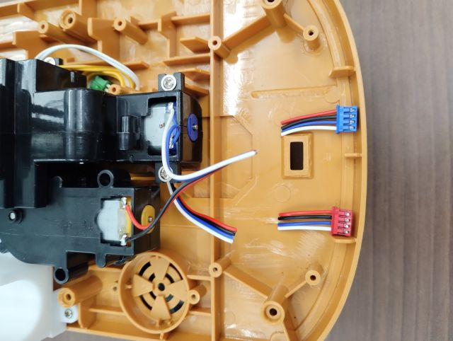
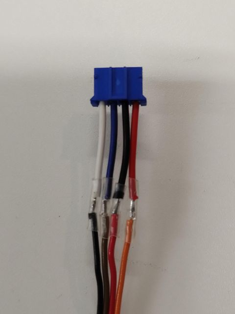
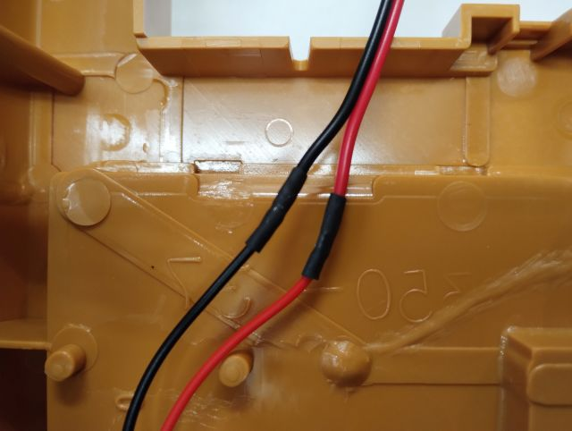

（Under preparation）

## ケーブルの作製

（Under preparation）

## クローラ用，旋回・ブーム用モータケーブルの延長

クローラを回転させるモータのケーブルと旋回軸とブームを回転させるモータのケーブルが元の状態だと短いため，カバーの外に出るように延長します．  

!!! note
    ここでは，元々ついているケーブルを切断し，追加のケーブルを間にはんだ付けして延長する方法を説明します．  
    ただし，必要な長さになって，端に元と同じ規格のコネクタがついていれば他の方法でも構いません．  
    他の方法としては，  

    - ケーブルをすべて作り直し，モータにはんだ付けする．  
    - コネクタを両端に付けた延長分の長さのケーブルを作り，中継コネクタで接続する．  
    
    などがあります．  

元々ついているクローラ用モータケーブルと旋回・ブーム用モータケーブルをぞれぞれ切断します．  

{ style="display:block; margin:0 auto; max-height:300px;" }

ケーブルの作製で用意した4芯，長さ150 mmのリボンケーブルと切断したケーブルの被膜を剥いで芯線をはんだ付けしてつなぎます．  
必ず元のケーブルの同じ色の線同士が繋がって,延長された状態になっていることを確認してください．  
また，隣の線の間で導通しないように，熱収縮チューブを各線のはんだ付けした箇所に被せてください．  
必要に応じて，はんだ付けした箇所がばらけないように，さらに外側から大きい熱収縮チューブでまとめても構いません．  

{ style="display:block; margin:0 auto; max-height:300px;" }

{ style="display:block; margin:0 auto; max-height:300px;" }

{ style="display:block; margin:0 auto; max-height:300px;" }

## 電源ケーブルの延長

駆動用バッテリを繋ぐ電源ケーブルも元の状態だと短いため，カバーの外に出るように延長します． 

!!! note
    モータのケーブルと同様に，元々ついているコネクタを切断し，追加のケーブルをはんだ付けして延長する方法を説明しますが，他の方法でも構いません．  

カバーの裏に伸びている電源ケーブルを先端で切断し，コネクタを取ります．  

{ style="display:block; margin:0 auto; max-height:300px;" }

ケーブルの作製で用意したXHコネクタを取り付けた長さ100 mmのダブルコードと切断したケーブルの被膜を剥いで芯線をはんだ付けしてつなぎます．  
赤と赤，黒と黒の線同士が繋がって,延長された状態になっていることを確認してください．  
また，隣の線の間で導通しないように，熱収縮チューブを各線のはんだ付けした箇所に被せてください．  

{ style="display:block; margin:0 auto; max-height:300px;" }

{ style="display:block; margin:0 auto; max-height:300px;" }

## ポテンショメータへのケーブルのはんだ付け

（Under preparation）

## 制御基板のはんだ付け

回路図，基板上のシルク，写真を参考に各部品をはんだ付けする．  
コネクタ，ICソケット，LEDは向きに注意すること．  

!!! note
    写真では，抵抗が内蔵されたLEDを使っています．  
    このため，R3には抵抗をつけずに，余ったLEDの足でジャンプさせています．  
    抵抗が必要な場合には，R3にはんだ付けしてください．  

!!! note
    IMU（Z1），バッテリ電圧測定用の分圧抵抗（R1，R2），拡張用コネクタ（J5，J6）はオプションです．  
    不要であればはんだ付けしなくても構いません．  
    また，拡張用コネクタ（J5，J6）は必要に応じて他のコネクタに変更しても構いません．      

{ style="display:block; margin:0 auto; max-height:500px;" }

{ style="display:block; margin:0 auto; max-height:500px;" }

{ style="display:block; margin:0 auto; max-height:300px;" }

基板上のシルクや写真を参考に，ADコンバータ，モータドライバ，IMUを基板上のソケットに取り付ける．  
いずれも向きに注意すること．  
また，モータドライバやIMUにピンヘッダが付けられていない場合には，先にはんだ付けする．  

{ style="display:block; margin:0 auto; max-height:500px;" }

{ style="display:block; margin:0 auto; max-height:500px;" }

## 旋回角推定用のセンサ基板のはんだ付け

回路図，基板上のシルク，写真を参考に各部品をはんだ付けする．  
フォトリフレクタ（U1）は向きに注意すること．  

{ style="display:block; margin:0 auto; max-height:300px;" }

{ style="display:block; margin:0 auto; max-height:300px;" }

{ style="display:block; margin:0 auto; max-height:300px;" }