<!-- # Step 5 旋回角推定センサの取り付け -->

下部走行体と上部旋回体の間の旋回角は，他の関節と異なり，グラデーション付きテープを貼り付けたリングとフォトリフレクタを用いて推定します．  
これは，白から黒に変化するグラデーションのついたテープを下部走行体の旋回軸の周りに貼り付け，テープを読み取るように設置したフォトリフレクタを上部旋回体と一緒に回転させることで，フォトリフレクタの受光強度から対応する角度を推定するものです．  
精度は良くありませんが，簡単に後付けで旋回角を推定することができます．  
下記に従い，土台となるリング，グラデーション付きテープ，フォトリフレクタを取り付けてください．  

## センサユニットの組み立て

フォトリフレクタのユニットを組み立てます．  
下図のように，フォトリフレクタ等をはんだ付けした基板とフォトリフレクタの周囲を覆う3Dプリント部品をねじ止めして組み立ててください．  
ピンヘッダが3Dプリント部品の穴に収まり，ねじが入る穴の位置が合う向きが正しい向きです．

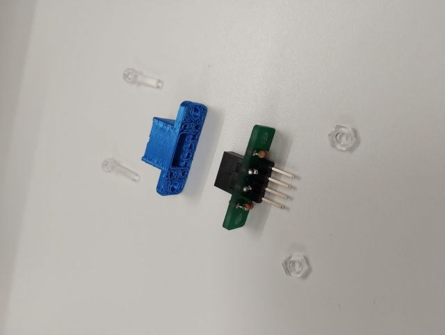{ style="display:block; margin:0 auto; max-height:300px;" }

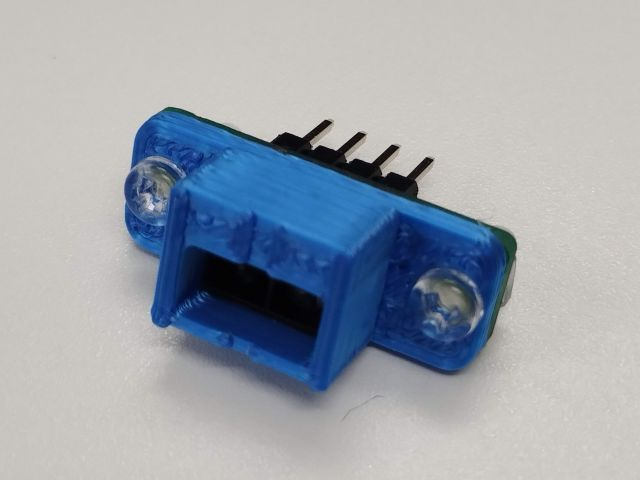{ style="display:block; margin:0 auto; max-height:300px;" }

## 使用するグラデーション付きテープの選定

（Under preparation）

## リングの取り付け

旋回角推定用のグラデーション付きテープを貼り付ける土台となるリングを下部走行体に取り付けます．  
リングは，左右に分割された点対称の構造を持つ3Dプリント部品です．  

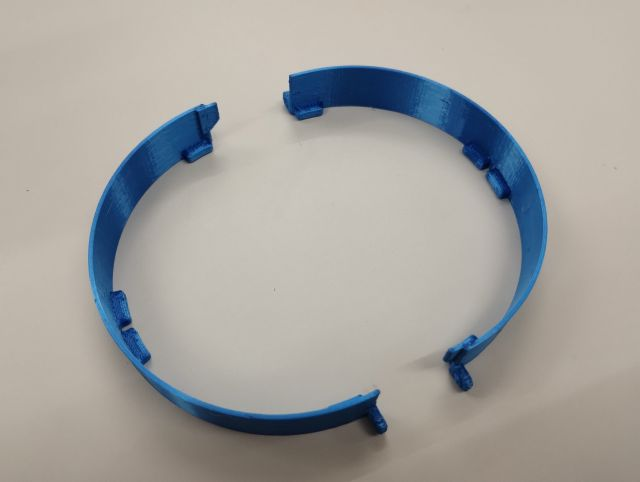{ style="display:block; margin:0 auto; max-height:300px;" }

これを下部走行体と上部旋回体の間に取り付けます．  
すき間から差し込み，下図のように，リングの内側の凸部と下部走行体の旋回部分の台座の凹部がかみ合い，かつ，リングの耳が下部走行体の左右の中央に来るようにしてください．  

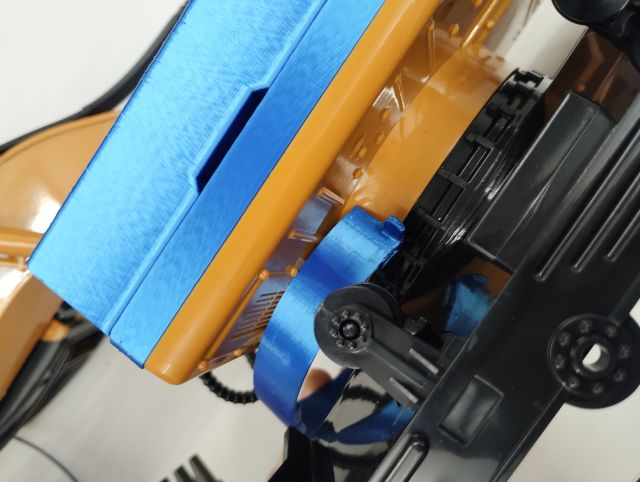{ style="display:block; margin:0 auto; max-height:300px;" }

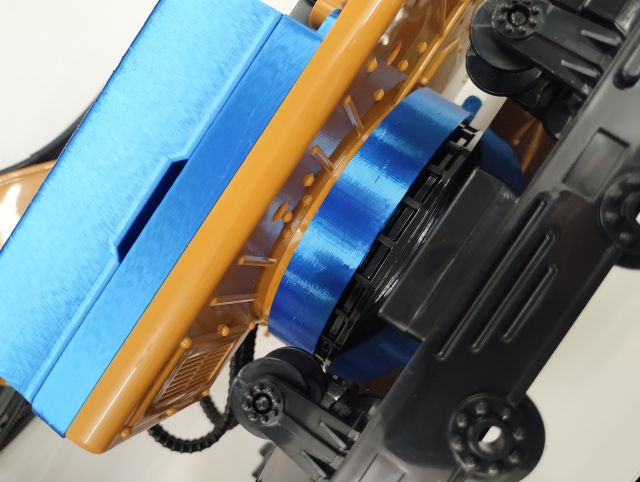{ style="display:block; margin:0 auto; max-height:300px;" }

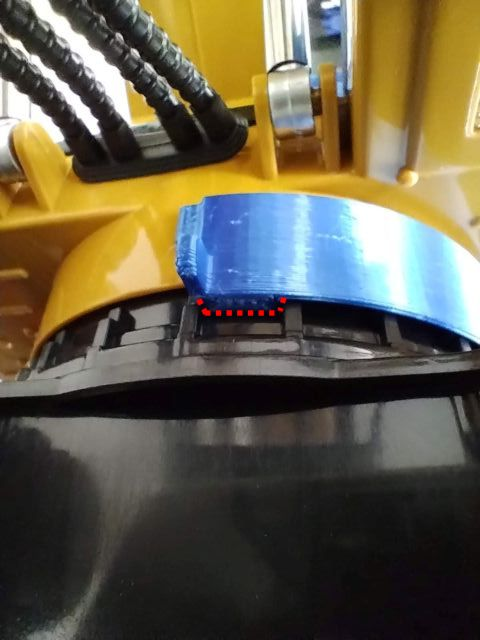{ style="display:block; margin:0 auto; max-height:300px;" }

両側同様に取り付けたら，下図の斜線の部分に接着剤をつけて左右のリングを接着してください．  
前後共に同様に接着してください．  

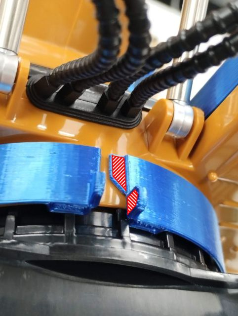{ style="display:block; margin:0 auto; max-height:300px;" }

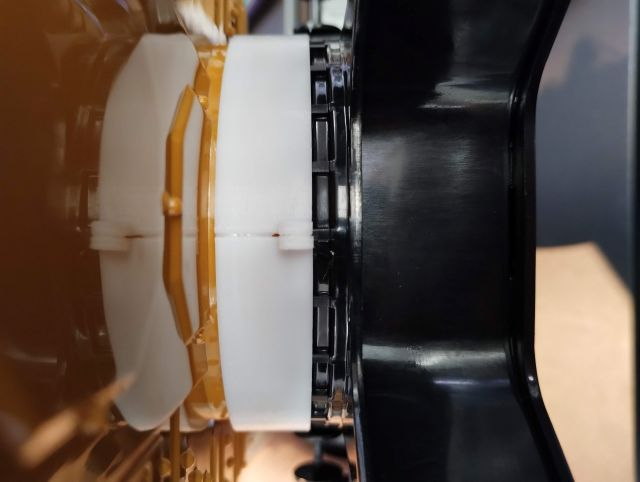{ style="display:block; margin:0 auto; max-height:300px;" }

## グラデーション付きテープの貼り付け

!!! warning
    リングの接着直後は剝がれやすいため，ある程度固定されるまで少し時間を空けてから次の作業に移った方が良いかもしれません．  

!!! note
    グラデーションの白と黒が切り替わる位置をショベルの下部走行体の前側に合わせる必要があります．  
    ショベルの前後は，クローラのスプロケットで見分けることができます．  
    クローラのスプロケットが従動側（自由に回転する側）が前，駆動側（モータで回転する側）が後ろです．  
    また，上部旋回体は，左右に約300度ずつ回転するので，手で回してそれを基準に確認することもできます．    

グラデーション付きテープをリングに貼り付けます．  
下図のように，グラデーション付きテープの裏面に両面テープを貼り付けてください．  
全面に両面テープを貼ると作業しづらいため，間隔を空けて数か所で構いません．  

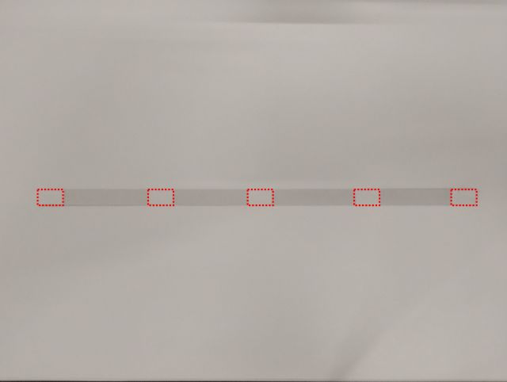{ style="display:block; margin:0 auto; max-height:300px;" }

グラデーション付きテープの片方の端の両面テープの剝離紙は残し，残りは剝がし，貼り付けられる状態にします．  
（以降は，黒い方の端の剥離紙を残した場合で説明しますが，逆でも構いません．）  
下図のように，剥離紙を残した側の端を下部走行体の中央に合わせて，グラデーション付きテープをリングに貼り付けていきます．  
リングから浮き上がらないようにきれいに貼ってください．  
一周したら，剥離紙を残した側の端を離し，先に反対側の端を貼り付けます．  

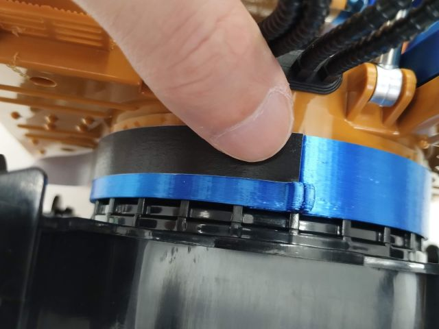{ style="display:block; margin:0 auto; max-height:300px;" }

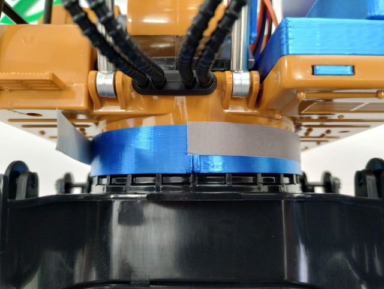{ style="display:block; margin:0 auto; max-height:300px;" }

最後に，残りの剥離紙も剥がし，リングに貼り付けます．  
印刷サイズが間違っていなければ，グラデーション付きテープは端が少し重なるように貼られ，白と黒が切り替わる位置がちょうど下部走行体の中央に来るはずです．

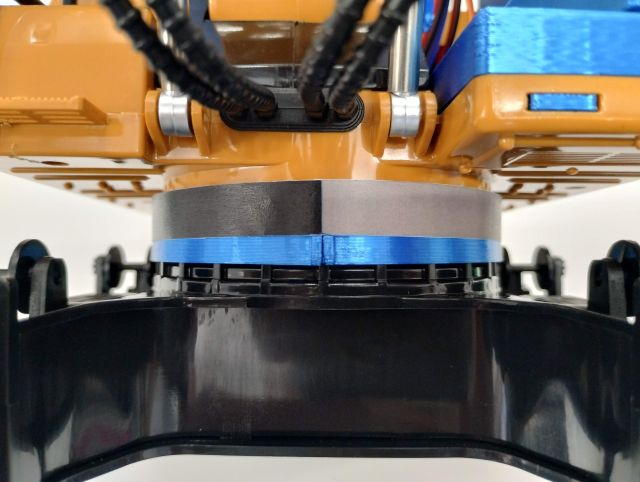{ style="display:block; margin:0 auto; max-height:300px;" }

## センサユニットの取り付け

フォトリフレクタのユニットを上部旋回体に取り付け，ADコンバータに接続するケーブルを配線します．  
まず，下図のように，フォトリフレクタのユニットの上部（ピンヘッダがある側）に両面テープを貼ります．  

!!! note
    センサの取り付け位置の調整が必要になることがある一方で，途中で落ちると計測できなくなるので，両面テープは適度に強めのものが良いです．  
    また，取り付け位置に凹凸があるため，少し厚めの両面テープを用いた方が，取り付けやすいです．  

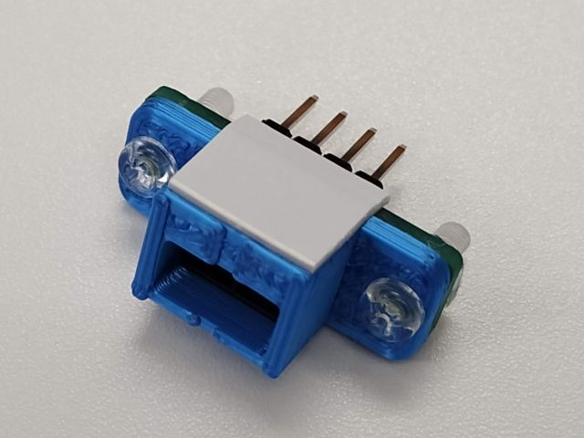{ style="display:block; margin:0 auto; max-height:300px;" }

上部旋回体の後方の裏面に，フォトリフレクタのユニットを貼り付けます．  
上部旋回体の左右の中央になるようにし，かつ，リングから約1 mm程度離して取り付けてください．   

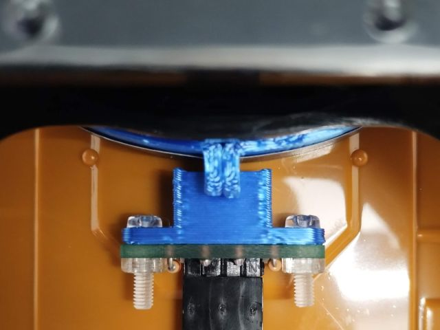{ style="display:block; margin:0 auto; max-height:300px;" }

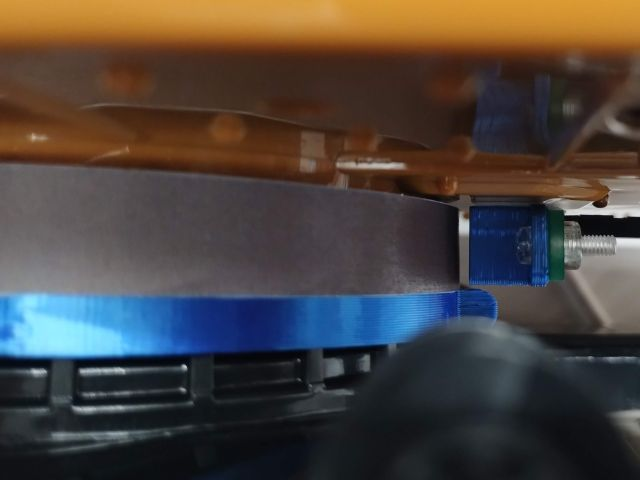{ style="display:block; margin:0 auto; max-height:300px;" }

## フォトリフレクタ用ケーブルの配線

次に，フォトリフレクタとADコンバータを接続するケーブルを配線します．  
上部旋回体の後方に，元々ラジコンの電源スイッチがついていた穴があるので，そこから裏側に通します．  

!!! note
    穴の幅とコネクタの幅がほぼぴったりでした．  
    押し込めば通りましたが，製品のばらつきにより通らないことがあるかもしれません．  
    その場合は，一度コネクタのハウジングを外しケーブルを通してからつけ直すか，穴を広げるかする必要があります．  

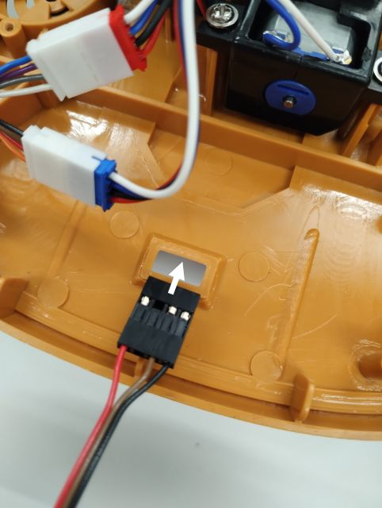{ style="display:block; margin:0 auto; max-height:300px;" }

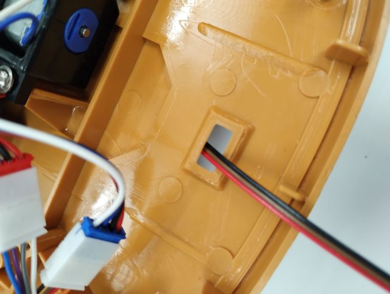{ style="display:block; margin:0 auto; max-height:300px;" }

最後に，裏に通したケーブルのコネクタをフォトリフレクタのユニットに接続します．  
コネクタ付近やケーブルを通した穴付近で，ケーブルをマスキングテープなどで止めておくと，旋回時に引っかかったり，コネクタが抜けたりすることを防止できます．  

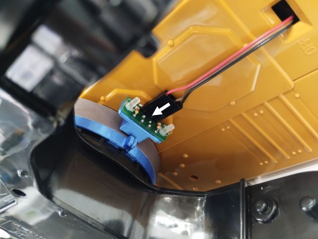{ style="display:block; margin:0 auto; max-height:300px;" }