<!-- # Step 6 組立てと配線 -->

最後に取り外したラジコンの部品や3Dプリント部品の取り付けと配線を行い，動かせる状態にします．  

## バッテリホルダの取り付け

3Dプリントしたバッテリホルダを取り付けます．  

まず，バッテリホルダとベースを組み立てます．  
ホルダの爪をベースの穴に合わせて差し込んでください．  
ホルダとベースの後端が揃うところまで差し込めるはずです．  

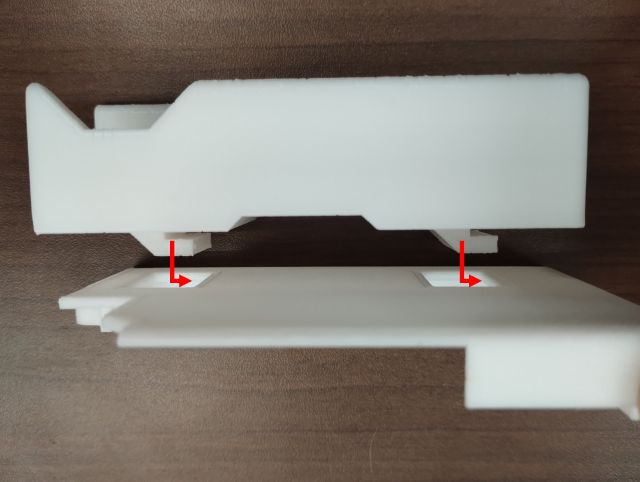{ style="display:block; margin:0 auto; max-height:300px;" }

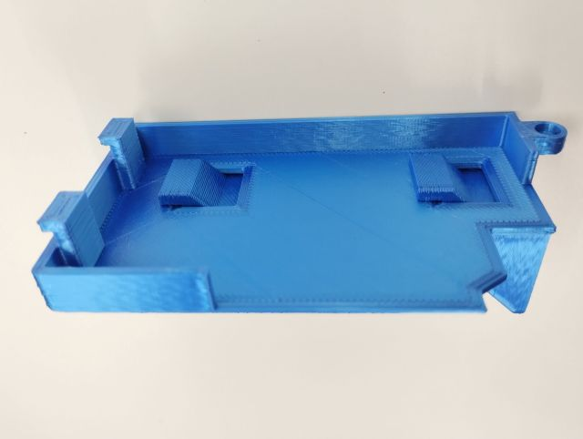{ style="display:block; margin:0 auto; max-height:300px;" }

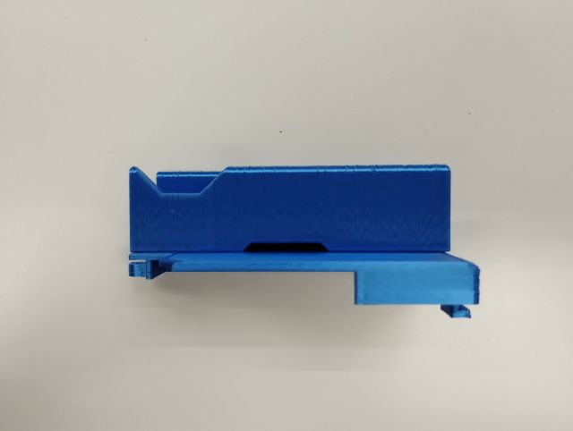{ style="display:block; margin:0 auto; max-height:300px;" }

ショベル本体のキャビンがあった位置に，組み立てたバッテリホルダを取り付けます．  
前側の2つの穴に爪を差し込み，後ろ側のネジ穴を合わせます．  
元々キャビンに使っていたネジで，バッテリホルダを動かないように本体に固定します．  

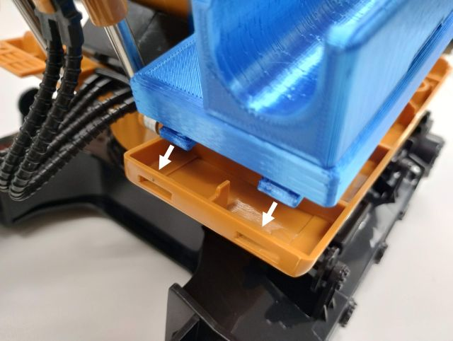{ style="display:block; margin:0 auto; max-height:300px;" }

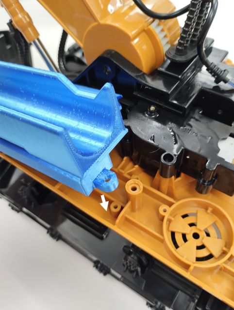{ style="display:block; margin:0 auto; max-height:300px;" }

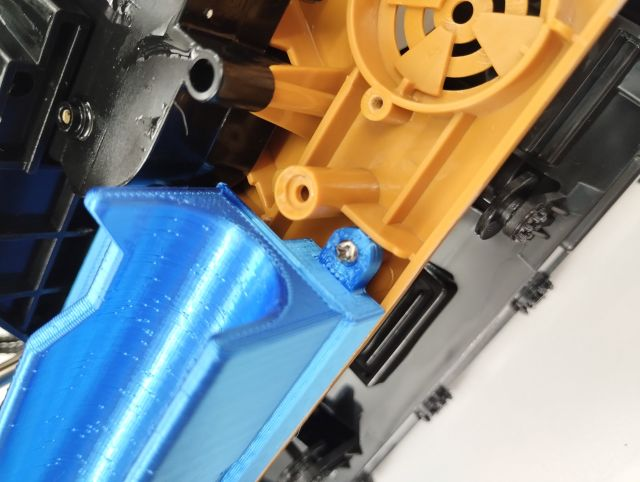{ style="display:block; margin:0 auto; max-height:300px;" }

## 後部カバーの取り付け

組み立てのために取り外した後部カバーを再度取り付けます．  
基本的には分解と逆の手順で行えばよいですが，ケーブルを挟まないように気を付けてください．  

まず，本体側のクローラ用モータケーブル，旋回・ブーム用モータケーブル，フォトリフレクタ用ケーブルの3本をまとめ，下図のようにブームのギヤボックスの上にマスキングテープなどで止めておきます．  

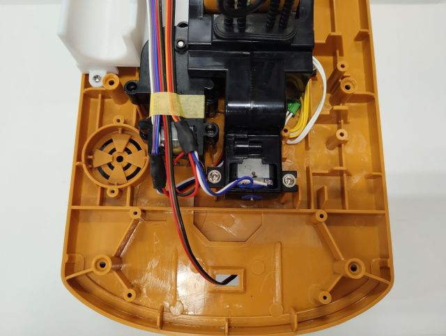{ style="display:block; margin:0 auto; max-height:300px;" }

カバー側も電源ケーブルを下図のようにマスキングテープで止めておきます．  

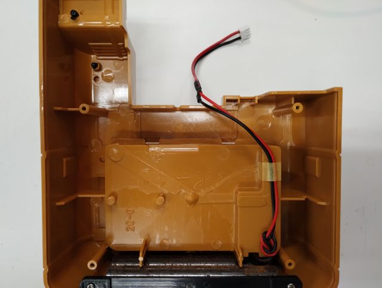{ style="display:block; margin:0 auto; max-height:300px;" }

本体の後ろ側からカバーを被せるように取り付けます．  
前後左右の位置，溝，右前方の手すりの穴が合うようにしてください．  
ケーブルはまとめているので，バッテリホルダ横の隙間から出ている状態になると思いますが，挟まないように注意してください．  
また，作業機（ブーム・アーム・バケット）側のモータやセンサのケーブルも挟まないように注意してください．  

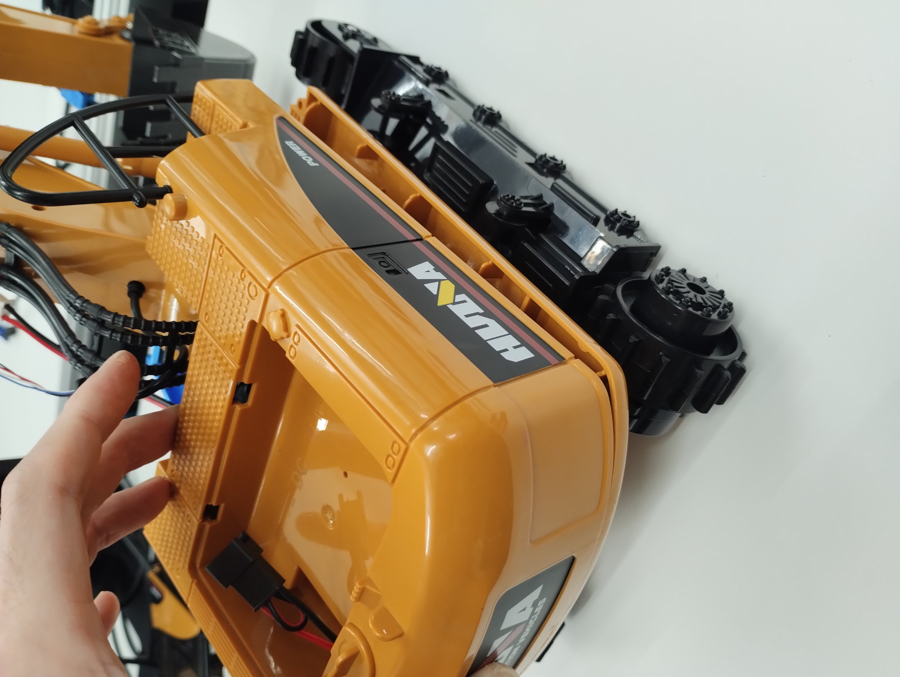{ style="display:block; margin:0 auto; max-height:300px;" }

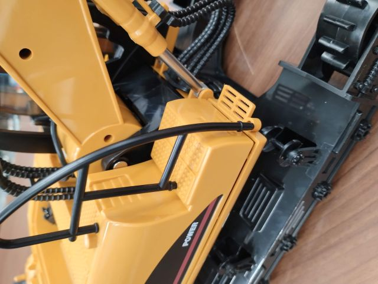{ style="display:block; margin:0 auto; max-height:300px;" }

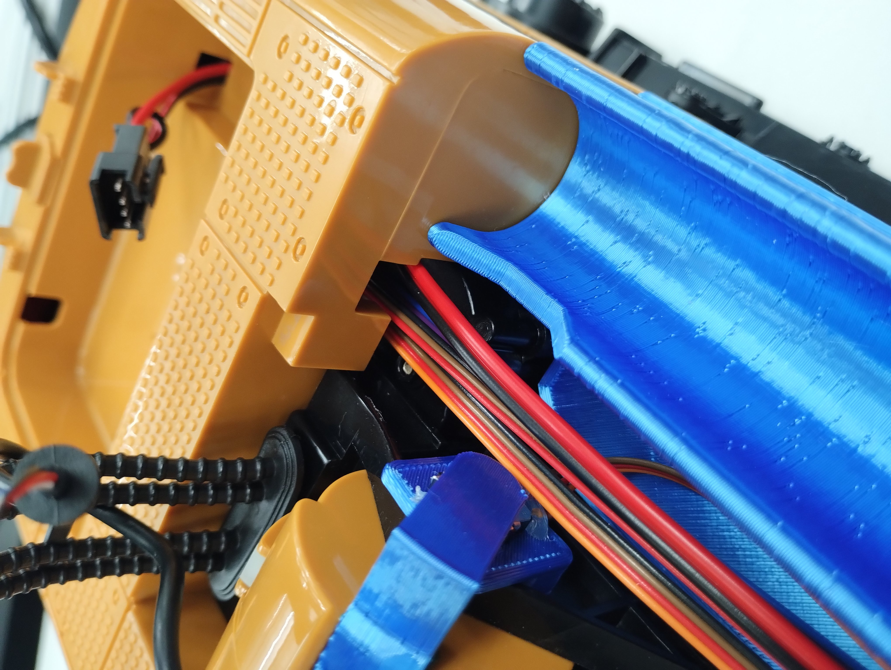{ style="display:block; margin:0 auto; max-height:300px;" }

最後に裏面のネジを止め，カバーを固定します．  
なお，見栄えを気にしなければ，側面の何か所かをテープで止めるだけでも構いません．  
（その方がメンテナンスがしやすかったりします．）  

## アーム・バケットのポテンショメータ用ケーブルの固定

アームとバケットの関節角度を計測するためのポテンショメータにつながるケーブルは長いので，動作の邪魔にならないようにまとめておきます．  
可動域を考慮して適度に余裕をもって，シリンダーなどに結束バンドで固定してください．  
また，飾りの構造物の下を通して，動きにくくしても構いません．  

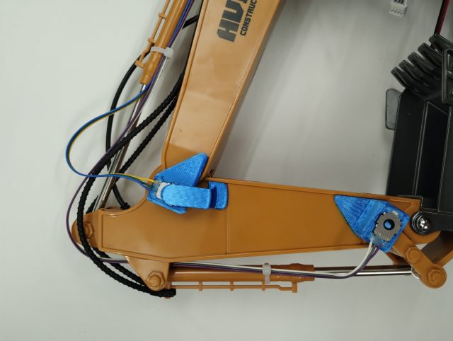{ style="display:block; margin:0 auto; max-height:300px;" }

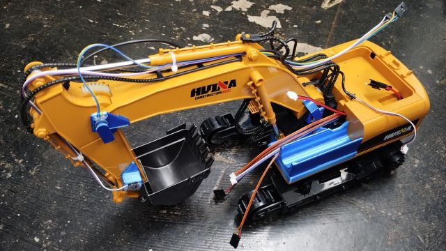{ style="display:block; margin:0 auto; max-height:300px;" }

## 各ケーブルのボードPCへの接続

すべてのケーブルをRaspberry Piに重ねた基板上のコネクタに接続します．  

まず，後部カバーの上のバッテリを載せるスペースに，Raspberry Piを載せた3Dプリントの蓋を載せます．  

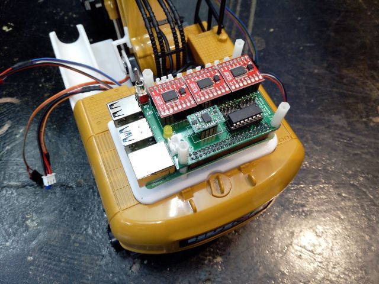{ style="display:block; margin:0 auto; max-height:300px;" }

駆動用バッテリの電源ケーブルと各モータにつながるケーブルを基板に接続します．  
下図を参考に接続位置とコネクタの向きに気を付けてください．

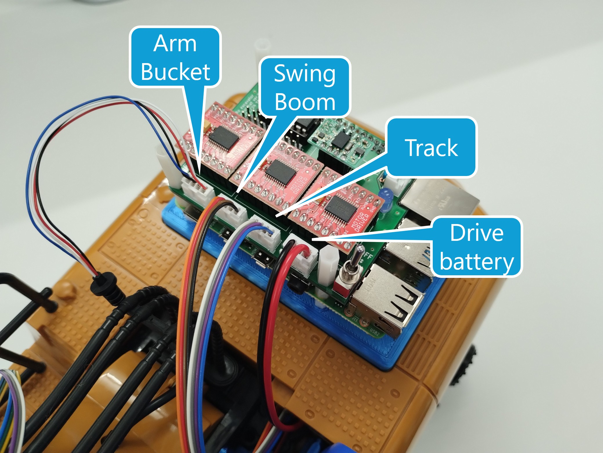{ style="display:block; margin:0 auto; max-height:300px;" }

各センサからのケーブルを基板に接続します．  
下図を参考に接続位置とコネクタの向きに気を付けてください．  
（特に，このコネクタは逆向きやずれた位置でも挿せてしまうので，注意してください．）  

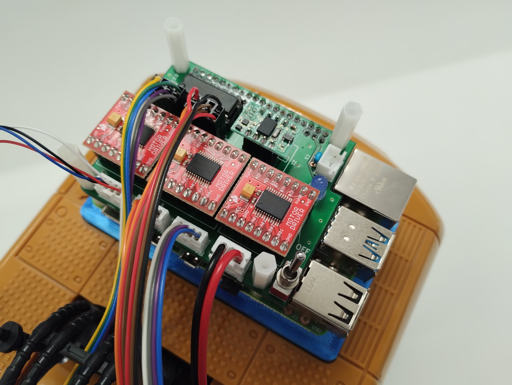{ style="display:block; margin:0 auto; max-height:300px;" }

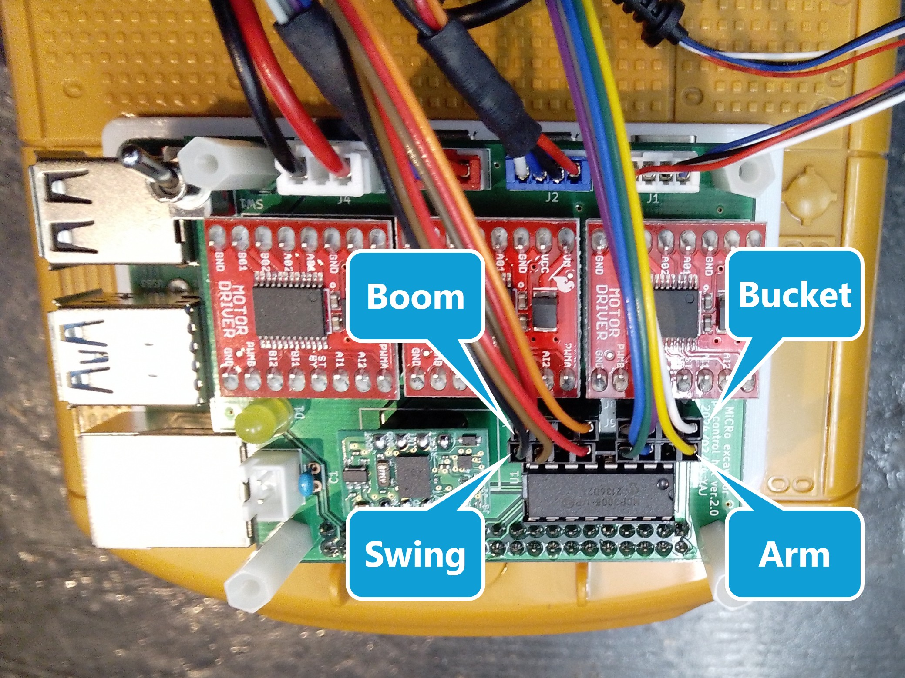{ style="display:block; margin:0 auto; max-height:300px;" }

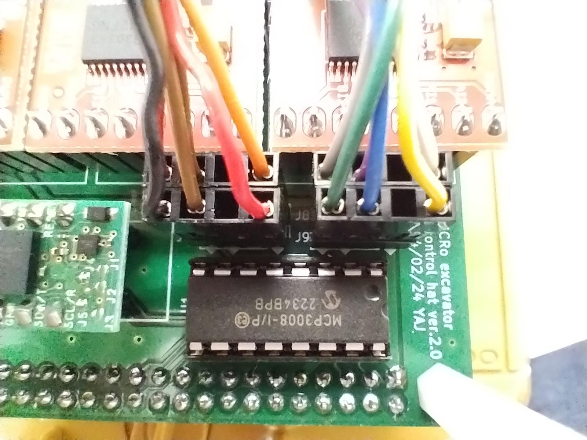{ style="display:block; margin:0 auto; max-height:300px;" }

最後に，制御用モバイルバッテリの電源ケーブル（USB Type-A to Type-C）をRaspberry PiのUSB Type-Cのポートに接続します．  

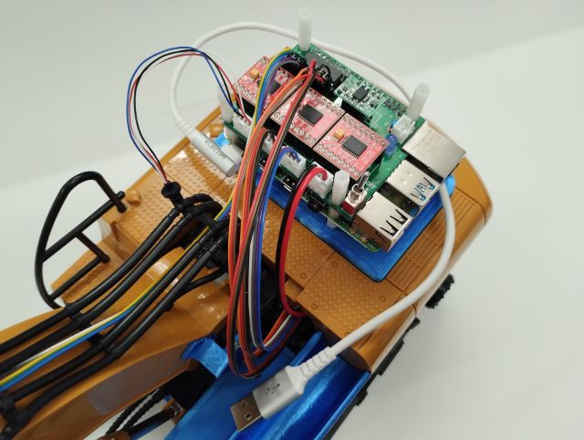{ style="display:block; margin:0 auto; max-height:300px;" }

## クローラベルトの取り付け

取り外したクローラベルトを再度取り付けます．  
基本的には分解と逆の手順で行えばよいです．  
駆動側（後ろのモータで回転する側）のスプロケットにベルトを掛けてから，従動側（前の自由に回転する側）に掛けるのがやりやすいと思います．  

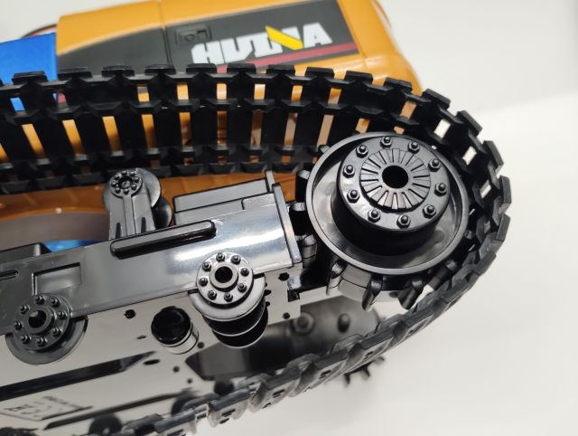{ style="display:block; margin:0 auto; max-height:300px;" }

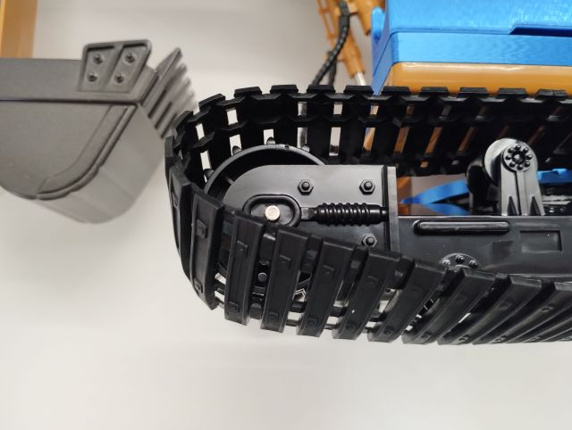{ style="display:block; margin:0 auto; max-height:300px;" }

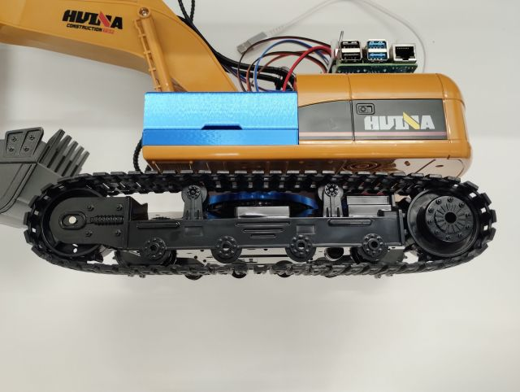{ style="display:block; margin:0 auto; max-height:300px;" }