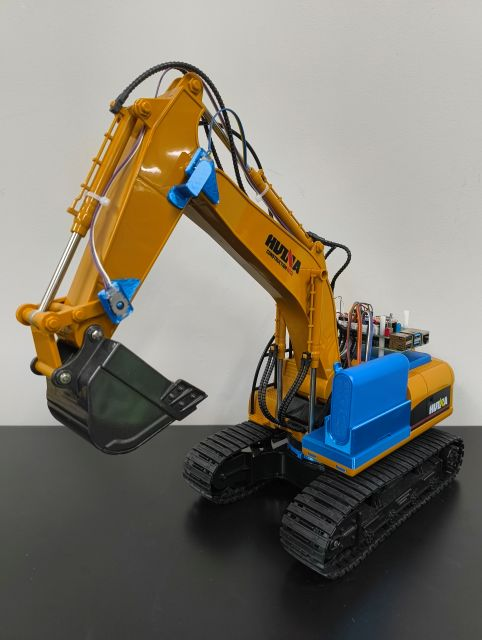

# MiRoREA Excavator

MiRoREA Excavatorは，市販のラジコンをベースに，制御用ボードPCやセンサ等を組み込みロボット化した，ショベル型の模型建設ロボットです．

{ style="display:block; margin:0 auto; width:300px;" }

!!! info "作業・公開の進捗状況"
    - **概要**: 執筆中，一部完成
    - **システム構成**: 準備中
    - **ハードウェアの作り方**: 概要は完成，Step 0 準備と部品を執筆中
    - **ソフトウェアのセットアップ**: 未着手

## Capabilities

- 旋回・ブーム・アーム・バケットの動作による掘削・放土・積込
- クローラによる移動

## Features

- 左右クローラ・旋回・ブーム・アーム・バケットの各関節のモータの制御
- ポテンショメータによるブーム・アーム・バケットの各関節角度の計測
- フォトリフレクタとグラデーション付きリングによる旋回軸の関節角度の計測
- 搭載LEDの点灯・消灯
- 外付けスイッチのON/OFF監視
- 駆動用バッテリの電圧監視
- IMUによる姿勢等の推定 等

## License and Terms of Use

Under preparation  